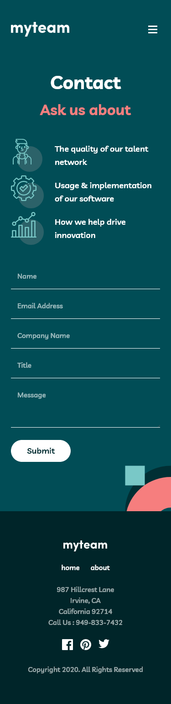

# Frontend Mentor - myteam website solution

This is a solution to the [myteam website challenge on Frontend Mentor](https://www.frontendmentor.io/challenges/myteam-multipage-website-mxlEauvW). Frontend Mentor challenges help you improve your coding skills by building realistic projects.

## Links

- Solution URL: [FrontEnd Mentor Solution Page](https://www.frontendmentor.io/solutions/myteam-multipage-website-5SY1XMZD_k)
- Live Site URL: [GitHub Pages Site](https://karolbanat.github.io/myteam-multi-page-website/)

## Built with

- Semantic HTML5 markup
- CSS custom properties
- Flexbox
- CSS Grid
- Mobile-first workflow

## Author

- Frontend Mentor - [@karolbanat](https://www.frontendmentor.io/profile/karolbanat)

## Screenshots

